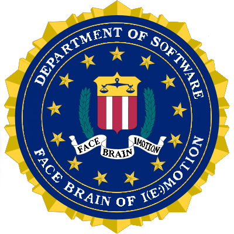

# FBI (Face Brain of I(e:)motion)

Capstone Design Project for Kookmin University, 2020

[**https://kookmin-sw.github.io/capstone-2020-2/**](https://kookmin-sw.github.io/capstone-2020-2/)

### **1. 프로젝트 소개**
---

                                               
**얼굴 표정 & 뇌파 신호 기반 감정 인식 및 분석 웹 서비스, FBI** 
FBI는 표정과 뇌파에 기반한 멀티 모달 감정 인식기술을 제공하는 웹 어플리케이션이다.
사용자가 웹 어플리케이션에서 재생되는 영상을 시청하는 동안 모자에 달린 뇌파측정 센서와 카메라로 사용자의 뇌파와 표정을 측정하고, 실시간으로 사용자의 감정을 분석하여 시각화한다. 또한 실시간으로 측정된 감정 분석 데이터를 누적하여 최종 감정 분석 결과를 제공한다. 분석 결과에 대해서는 표정, 뇌파, 멀티모달(표정+뇌파)에 대한 각 결과를 모두 반영함으로써 보다 명확하고 신뢰성 있는 분석 서비스를 제공한다.
FBI는 기존의 단일 패턴 감정 분석 시스템에서 벗어나, 두 가지 신호 데이터를 기반으로 유저의 감정을 분석하는 멀티 모달 감정인식 시스템을 개발함으로써 각 데이터의 한계점을 보완하여 체계적이고 정확한 감정인식 기술을 제공하는 것을 목표로 한다. 특수환경(교도소, 병원)에서 맞춤형 심리 치료나 감정표현에 어려움을 겪는 사용자의 감정인식이 필요한 곳에서 FBI의 감정 인식 및 분석 서비스가 해결책이 될 수 있을 것이다.
  
**Facial recognition & brain wave signal based emotion recognition and analysis web service, FBI** 
FBI is a web application that provides multi-modal emotion recognition technology based on facial expressions and brain waves.
While the user is watching the video played in the web application, the EEG sensor on the hat and camera are used to measure the user's brainwaves and facial expressions. Based on this, the user's emotions are analyzed and visualized in real-time. In addition, the real-time emotion analysis data is accumulated to provide the final emotion analysis result. For analysis results, we reflect all the results for facial expression, brain wave, and multi-modal (expression + brain wave) in UI which provide more clear and reliable analysis services.
FBI aims to provide a systematic and accurate emotion recognition technology by complementing the limitations of each data by developing a multi-modal emotion recognition system which analyzes the user's emotion based on two signal data, not  single pattern emotion analysis system which is existing. FBI's emotion recognition and analysis service can be a solution in places where special environment (prison, hospital) needs customized psychological treatment or emotion recognition of users who have difficulty expressing emotions.
  

### **2. 소개 영상**
---
**수행 계획 소개 영상**
 
Link: https://www.youtube.com/watch?v=4n9E5AUYYvU?t=0s
  
**1차 중간평가 발표 영상**
 
Link: https://www.youtube.com/watch?v=10gp0o0CV0o?t=0s
  
**1차 중간평가 시연 영상**
 
Link: https://www.youtube.com/watch?v=JV1dCH-8sd8?t=0s
  
**2차 중간평가 발표 영상**
 

  
**2차 중간평가 시연 영상**
 

  

### **3. 팀 소개**
---

### 윤상민 교수님 (Prof. Sang-Min Yoon)

&nbsp;&nbsp;- Role: 지도교수 & 멘토  
&nbsp;&nbsp;- Email: smyoon@kookmin.ac.kr  
       

### 이연지 (Yeon-Ji Lee)

&nbsp;&nbsp;- Student ID: 20171668  
&nbsp;&nbsp;- Role: 팀장, 뇌파 기반 감정 인식 모델 학습, multi-modal 분석모듈 개발  
&nbsp;&nbsp;- Email: nelumbotus@kookmin.ac.kr  
      

### 김경진 (Kyoungjin Kim)

&nbsp;&nbsp;- Student ID: 20170292  
&nbsp;&nbsp;- Role: Back-end server 및 DB 구축, back-end API 개발  
&nbsp;&nbsp;- Email: jinnymini@gmail.com  
      

### 김소정 (So-Jung Kim)

&nbsp;&nbsp;- Student ID: 20162753  
&nbsp;&nbsp;- Role: Front-end UI 구현  
&nbsp;&nbsp;- Email: sjk1708@gmail.com  
      

### 서명희 (Myoung-Hee Seo)

&nbsp;&nbsp;- Student ID: 20171627  
&nbsp;&nbsp;- Role: Back-end server 및 연동, front-end UI 구현, Github 관리, 통합 시연 환경  
&nbsp;&nbsp;- Email: myounghee.seo2@gmail.com  
      

### 이예림 (Ye-Rim Lee)

&nbsp;&nbsp;- Student ID: 20171670  
&nbsp;&nbsp;- Role: 표정 기반 감정 인식 모델 학습, 표정 및 multi-modal 분석모듈 개발 
&nbsp;&nbsp;- Email: lylim5050@kookmin.ac.kr  
      
  

### **4. 사용법**
---

**4.1 환경설정**   
-  src/readme.md 참고  

**4.2 실행하기**  
- EEG 센서 가동 및 실행 컴퓨터에 연결 USB 삽입  
- src/analyze/eeg/ 폴더 이동 후  
&nbsp;&nbsp;&nbsp;&nbsp; $ python record_signal.py y  
- src/back-end/FBI 폴더 이동 후  
&nbsp;&nbsp;&nbsp;&nbsp; $ python manage.py runserver  
- src/front-end 폴더 이동 후  
&nbsp;&nbsp;&nbsp;&nbsp; $ npm start  

  
